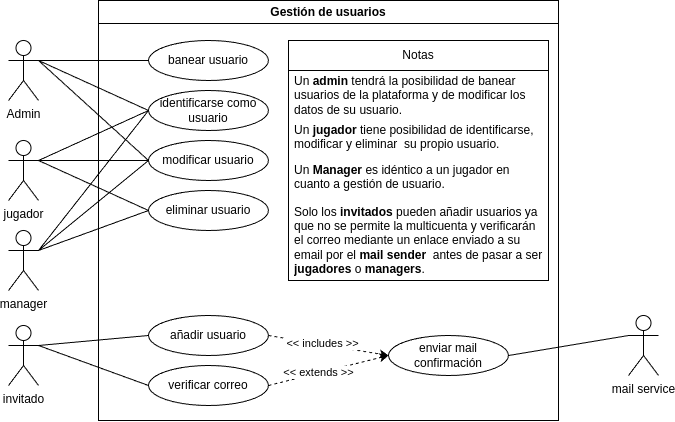

# Sistema de Gestión de Torneos de eSports
## Autor
Jose Luis García Pelayo  
Link a Github: [JoseLuisPelayo](https://github.com/JoseLuisPelayo)    

## Descripción del Proyecto
 ### Análisis del problema y requisitos del sistema.  
   Construcción de una plataforma en la que se organizan y gestionan torneos de e-sports, se pueden registrar managers y jugadores en la plataforma, los managers podrán invitar a los jugadores a jugar en sus equipos, y los administradores se encargan de gestionar los torneos y administrar tanto premios como castigos.

 #### ¿Quiénes son los actores que interactúan con el sistema?
   - Administradores
   - Jugadores
   - Managers
   - Invitados  

 #### ¿Cuáles son las acciones que cada actor puede realizar?  
    |-------------------|-------------------|--------------------|-------------------|-------------------|
    |      ACCIONES     |     INVITADOS     |     JUGADORES      |      MANAGERS     |  ADMINISTRADORES  |
    |-------------------|-------------------|--------------------|-------------------|-------------------|
    |Consultarlista de  |         ✅        |         ✅         |         ✅        |         ✅        |
    |equipos, jugadores |                   |                    |                   |                   |  
    |-------------------|-------------------|--------------------|-------------------|-------------------|
    |  Añadir usuario   |         ✅        |                    |                   |                   |  
    |-------------------|-------------------|--------------------|-------------------|-------------------|
    |Identificarse como |                   |         ✅         |         ✅        |         ✅        |
    |usuario            |                   |                    |                   |                   |  
    |-------------------|-------------------|--------------------|-------------------|-------------------|
    |Registrar equipo   |                   |                    |         ✅        |                   |
    |-------------------|-------------------|--------------------|-------------------|-------------------|
    |Invitar jugador a  |                   |                    |         ✅        |                   |
    |un equipo          |                   |                    |                   |                   |  
    |-------------------|-------------------|--------------------|-------------------|-------------------|
    |Expulsar jugador de|                   |                    |         ✅        |                   |
    |un equipo          |                   |                    |                   |                   |  
    |-------------------|-------------------|--------------------|-------------------|-------------------|
    |Aceptar unirse a un|                   |         ✅         |                   |                   |
    |equipo             |                   |                    |                   |                   |  
    |-------------------|-------------------|--------------------|-------------------|-------------------|
    |Dejar un equipo    |                   |         ✅         |                   |                   |
    |-------------------|-------------------|--------------------|-------------------|-------------------|
    |Banear un equipo   |                   |                    |                   |         ✅        |
    |-------------------|-------------------|--------------------|-------------------|-------------------|
    |Banear un jugador  |                   |                    |                   |         ✅        |
    |-------------------|-------------------|--------------------|-------------------|-------------------|  

#### ¿Cómo se relacionan entre sí las entidades del sistema?
Los Daos se encargan de la capa de persistencia proporcionando y recibiendo datos de los controladores, estos últimos se encargaran de manejar la lógica del negocio, y se relacionan con los modelos que son la representación de las entidades y contienen su estructura, siendo el centro neurálgico de el sistema que se asegura de que se cumpla la lógica del negocio, y haciendo de intermediario entre los datos, los modelos y las vistas.

## Diagramas UML
### Diagrama de Casos de Uso
#### Gestión de usuarios

#### Gestión de jugadores y equipos

### Diagrama de Clases

## Estructura del Proyecto
torneo-esports-uml/  
├── src/  
│ ├── main  
│ │ ├── org/torneo/  
│ │ │ ├── business/  
│ │ │ ├── controller/  
│ │ │ ├── model/  
│ │ │ ├── utils/  
│ │ │ ├── view/  
│ │ │ ├── Main.java  
│ ├─ diagrams/  
│ ├─ README.md
