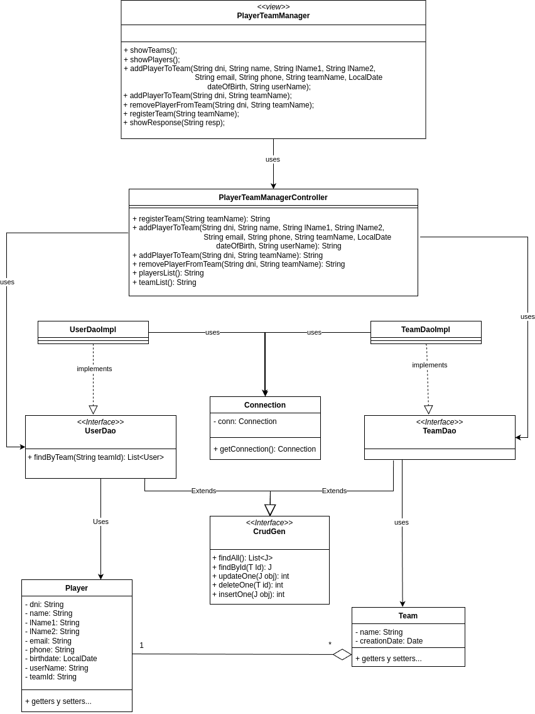

# Sistema de Gestión de Torneos de eSports
## Autor
Jose Luis García Pelayo  
Link a Github: [JoseLuisPelayo](https://github.com/JoseLuisPelayo)    

## Descripción del Proyecto
 ### 1. Análisis del problema y requisitos del sistema.  
   Construcción de una aplicación para gestionar torneos de e-sports.

 #### ¿Quiénes son los actores que interactúan con el sistema?
   - Con el sistema solo interactuará los administradores encargados de gestionar los torneos.

 #### ¿Cuáles son las acciones que cada actor puede realizar?  
   - Consultar lista de equipos y jugadores.
     - Todos los jugadores guardados en base de datos.
     - Todos los equipos con sus respectivos jugadores.
   -  Registrar nuevo equipo.
   - Añadir jugador a un equipo.
     - Añadir un jugador ya existente en base de datos.
     - Crear un nuevo jugador y añadirlo al equipo correspondiente.
   - Eliminar jugador de un equipo.

#### ¿Cómo se relacionan entre sí las entidades del sistema?
Los Daos se encargan de la capa de persistencia proporcionando y recibiendo datos de los controladores, estos últimos se encargaran de manejar la lógica del negocio, y se relacionan con los modelos que son la representación de las entidades y contienen su estructura, siendo el centro neurálgico de el sistema que se asegura de que se cumpla la lógica del negocio, y haciendo de intermediario entre los datos, los modelos y las vistas.

## Diagramas UML
### Diagrama de Casos de Uso

### Diagrama de Clases


## Estructura del Proyecto
torneo-esports-uml/  
├── src/  
│ ├── main  
│ │ ├── org/torneo/  
│ │ │ ├── business/  
│ │ │ ├── controller/  
│ │ │ ├── model/  
│ │ │ ├── utils/  
│ │ │ ├── view/  
│ │ │ ├── Main.java  
│ ├─ diagrams/  
│ ├─ README.md


## Instalación y Ejecución
 1. Requisitos:  
    - Necesitas tener docker instalado en tu sistema para poder usar el proyecto.
    - Necesitas tener Maven.
2. Clonar el repositorio:  
   `git clone https://github.com/JoseLuisPelayo/torneo-esports-uml.git`
3. navegar al proyecto  
   `cd torneo-esports-uml`
4. Montar contenedor con mysql:  
   `docker compose up -d`
5. Compilar y ejecutar el proyecto:  
   ```
   mvn compile
   mvn exec:java
   ```
## Justificación del diseño
Siguiendo el patrón MVC (Modelo-Vista-Controlador) requerido, opte por separar un poco más las responsabilidades
 añadiendo una capa de persistencia.
- Modelo (model/): Contiene las clases que representan las entidades principales del sistema (jugadores, equipos).
Estas clases encapsulan la estructura de los datos.

- Controlador (controller/): Se encarga de coordinar la lógica de negocio, gestionando la interacción entre los modelos 
y las vistas.

- Negocio (business/): Contiene los servicios que implementan la lógica principal del sistema.

- Vista (view/): Se encarga de mostrar la información al usuario (en este caso, el administrador del sistema),
facilitando la interacción.

- Utilidades (utils/): Se incluyen clases reutilizables, como conexiones u otras cosas.

## Conclusiones
Este proyecto me ha hecho enfrentarme al diseño de una aplicación desde cero, lo cual ha sido un reto en muchos sentidos.
Al principio empecé implementando todo en memoria, pero más adelante decidí pasar la lógica a una base de datos MySQL. 
Ese cambio me trajo bastantes complicaciones, especialmente porque trabajar en memoria es muy distinto a trabajar
con persistencia real, y tuve que replantear parte de la estructura y la lógica.

A pesar de esos problemas, todo el proceso me ha servido muchísimo para aprender a analizar mejor los requisitos, ver 
distintas formas de resolver un mismo problema y entender las implicaciones de cada decisión que se toma durante el 
desarrollo. También me ha ayudado a ganar confianza a la hora de estructurar un proyecto, organizar el código en capas 
y a pensar más allá del funcionamiento inmediato: en cómo se puede mantener y escalar una aplicación en el futuro.